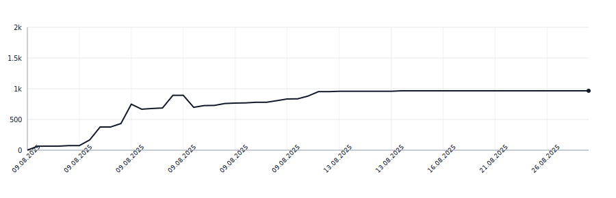

[](https://github.com/apakabarfm/syllabreak/actions/workflows/tests.yml)

# syllabreak

Multilingual library for accurate and deterministic hyphenation and syllable counting without relying on dictionaries.

## Supported Languages

- 🇬🇧 English (`eng`)
- 🇷🇺 Russian (`rus`)
- 🇷🇸 Serbian Cyrillic (`srp-cyrl`)
- 🇷🇸 Serbian Latin (`srp-latn`)
- 🇹🇷 Turkish (`tur`)
- 🇬🇪 Georgian (`kat`)
- 🇩🇪 German (`deu`)

## Usage

### Auto-detect language

When no language is specified, the library automatically detects the most likely language:

```python
>>> from syllabreak import Syllabreak
>>> s = Syllabreak("-")
>>> s.syllabify("hello")
'hel-lo'
>>> s.syllabify("здраво")  # Serbian Cyrillic
'здра-во'
>>> s.syllabify("привет")  # Russian
'при-вет'
```

### Specify language explicitly

You can specify the language code for more predictable results:

```python
>>> s = Syllabreak("-")
>>> s.syllabify("problem", lang="eng")  # Force English rules
'pro-blem'
>>> s.syllabify("problem", lang="srp-latn")  # Force Serbian Latin rules
'prob-lem'
```

This is useful when:
- The text could match multiple languages
- You want consistent rules for a specific language
- Processing text in a known language

## Language Detection

The library returns all matching languages sorted by confidence:

```python
>>> from syllabreak import Syllabreak
>>> s = Syllabreak()
>>> s.detect_language("hello")
['eng', 'srp-latn', 'tur']  # Matches English, Serbian Latin and Turkish
>>> s.detect_language("čovek")
['srp-latn', 'eng', 'tur']  # Serbian Latin has highest confidence due to č
```

## Lines of Code

<picture>
  <source media="(prefers-color-scheme: dark)" srcset=".github/loc-history-dark.svg">
  <source media="(prefers-color-scheme: light)" srcset=".github/loc-history-light.svg">
  
</picture>
